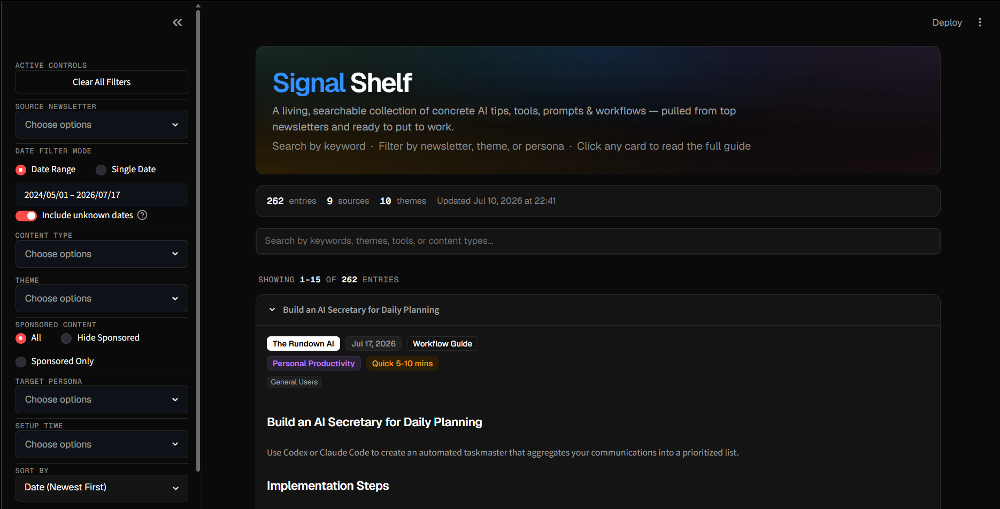

# Signal-shelf: Curated Insights from AI Newsletters

A Streamlit + DuckDB dashboard for browsing curated, actionable AI newsletter insights.

[](https://www.python.org/)
[](https://streamlit.io/)
[](https://duckdb.org/)
[](https://pandas.pydata.org/)
[](LICENSE)

---

## What is this?

**Signal-shelf** is a sleek, modern analytics dashboard designed to help users browse, search, and extract actionable insights (tips, tools, prompts, and workflows) from AI newsletters. Powered by Streamlit and DuckDB, the dashboard acts as a local repository that filters and processes curated data efficiently. It allows users to quickly search, categorize, and act on the latest updates in the AI ecosystem without email clutter.

---

## Screenshots



---

## Tech Stack

The application is built using the following modern Python libraries and frameworks:
- **Python**: Core programming language.
- **Streamlit**: Elegant, reactive UI framework.
- **DuckDB**: Fast, in-process SQL database engine for local JSONL analysis.
- **Pandas**: Structured data manipulation and processing.
- **Streamlit Autorefresh**: Real-time hot-reloading of local data updates.

---

## Getting Started

Follow these step-by-step instructions to set up the project locally on your machine.

### Prerequisites

Make sure you have Python 3.10+ installed on your system.

### 1. Clone the Repository

Clone this repository and navigate to the project directory:

```bash
git clone https://github.com/premkumar-1122/Signal-Shelf.git
cd Signal-Shelf
```

### 2. Create a Virtual Environment

Set up a virtual environment to isolate the project dependencies:

- **Windows:**
  ```powershell
  python -m venv .venv
  .venv\Scripts\activate
  ```
- **macOS / Linux:**
  ```bash
  python3 -m venv .venv
  source .venv/bin/activate
  ```

### 3. Install Dependencies

Install the required packages using `pip`:

```bash
pip install -r requirements.txt
```

### 4. Set Up the Local Database

Copy the template JSONL file to initialize your local database:

- **Windows (PowerShell):**
  ```powershell
  Copy-Item Resources/resource_database_template.jsonl Resources/resource_database.jsonl
  ```
- **macOS / Linux:**
  ```bash
  cp Resources/resource_database_template.jsonl Resources/resource_database.jsonl
  ```

### 5. Run the Application

Launch the Streamlit dashboard:

```bash
streamlit run app.py
```

---

## How to Add Your Own Data

The dashboard reads directly from `Resources/resource_database.jsonl`. To populate the database with your own newsletter summaries, add new lines containing JSON objects structured as follows:

```json
{
  "s_no": "4",
  "source_newsletter": "AI For Work",
  "date_of_appearance": "11-07-2026",
  "content_type": "Workflow Guide",
  "theme": "Coding/Automation",
  "extracted_content": "## Your Markdown Heading\n\nDetailed description of prompt or tip goes here...",
  "sponsored_content": "No",
  "target_persona": "Software Engineers",
  "estimated_setup_time": "Quick 5-10 mins"
}
```

### JSON Schema Fields

- `s_no` *(string)*: A unique serial number (must be an integer within a string representation, e.g. `"1"`).
- `source_newsletter` *(string)*: Name of the newsletter source (e.g. `"AI For Work"`, `"The Rundown AI"`, `"TLDR AI"`).
- `date_of_appearance` *(string)*: The date published in `DD-MM-YYYY` format (or `"unknown"`).
- `content_type` *(string)*: Category of insight (e.g. `"Workflow Guide"`, `"Tool Tip"`, `"Prompt Tutorial"`).
- `theme` *(string)*: The primary area/domain (e.g. `"Coding/Automation"`, `"Personal Productivity"`).
- `extracted_content` *(string)*: Markdown formatted string containing the actual tips or guide text.
- `sponsored_content` *(string)*: `"Yes"` or `"No"`.
- `target_persona` *(string)*: The target audience for this advice.
- `estimated_setup_time` *(string)*: A string representing implementation complexity (e.g. `"Quick 5-10 mins"`, `"Medium 10-30 mins"`, `"Deep Setup > 30 mins"`).

---

## License

Distributed under the MIT License. See [LICENSE](LICENSE) for more details.
